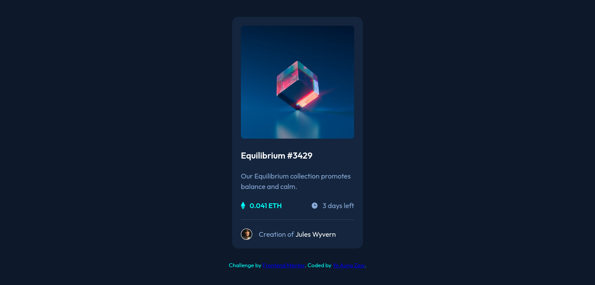

# Frontend Mentor - NFT preview card component solution

This is a solution to the [NFT preview card component challenge on Frontend Mentor](https://www.frontendmentor.io/challenges/nft-preview-card-component-SbdUL_w0U). Frontend Mentor challenges help you improve your coding skills by building realistic projects. 

## Table of contents

- [Overview](#overview)
  - [The challenge](#the-challenge)
  - [Screenshot](#screenshot)
  - [Links](#links)
- [My process](#my-process)
  - [Built with](#built-with)
  - [What I learned](#what-i-learned)
  - [Continued development](#continued-development)
  - [Useful resources](#useful-resources)
- [Author](#author)

## Overview

### The challenge

Users should be able to:

- View the optimal layout depending on their device's screen size
- See hover states for interactive elements

### Screenshot

### Links

- Solution URL: [Solution](https://github.com/yeaungzaw/week3-frontend-speedrun/tree/main/docs/nft-preview-card-component)
- Live Site URL: [Live Site](https://yeaungzaw.github.io/week3-frontend-speedrun/nft-preview-card-component/index.html)

## My process

### Built with

- Semantic HTML5 markup
- CSS custom properties
- Flexbox
- Mobile-first workflow

### What I learned

By doing this project, I learnt position, flexbox and background properties.

### Continued development

This project didn't require CSS Grid. I look forward to using them in future projects when it makes sense to do so.

### Useful resources

- [CSS Custom Properties](https://developer.mozilla.org/en-US/docs/Web/CSS/Using_CSS_custom_properties) - This helped me simplify the solution by putting all the design mandated selections into variables that I could use throughout the CSS. This sets everything up so that if a design choice is changed later, I'll only need to reset the custom property in :root instead of throughout the CSS.
- [CSS Flexbox](https://css-tricks.com/snippets/css/a-guide-to-flexbox/) - This is an amazing complete guide that explains everything about flexbox, focusing on all the different possible properties for the parent element (the flex container) and the child elements (the flex items). It also includes history, demos, patterns, and a browser support chart.
- [background-position](https://developer.mozilla.org/en-US/docs/Web/CSS/background-position) - This helped me to understand the background position property simply and quickly.

## Author

- Github  - [yeaungzaw](https://github.com/yeaungzaw)
- Frontend Mentor - [Ye Aung Zaw](https://www.frontendmentor.io/profile/yourusername)
- Linkedin - [Ye Aung Zaw](https://www.linkedin.com/in/yeaungzaw/)
